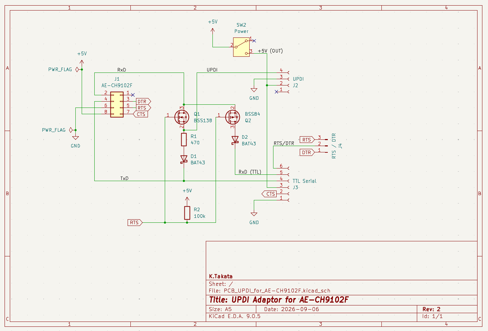
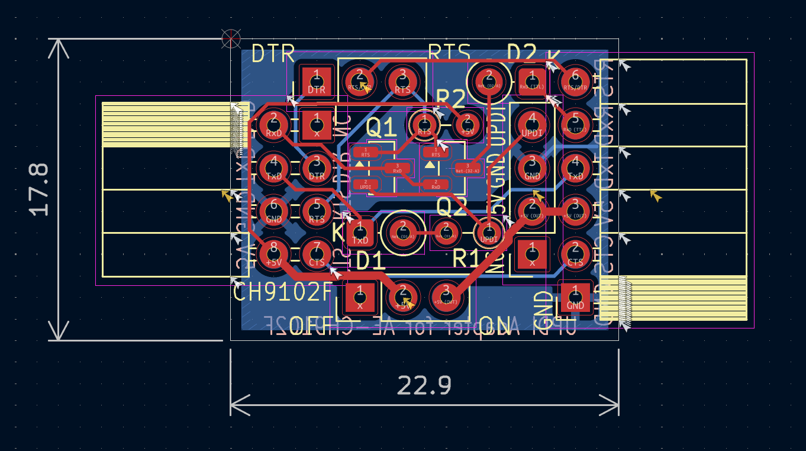
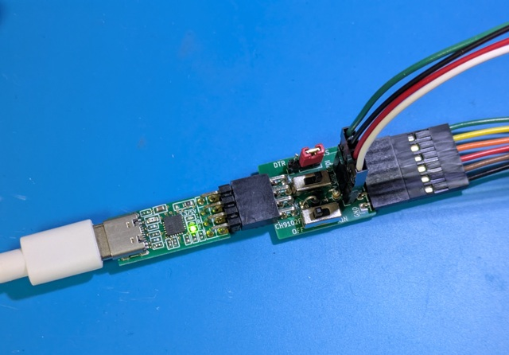

# UPDI Adapter for AE-CH9102F (Rev. 2)

## 概要

[秋月電子](https://akizukidenshi.com/)の[CH9102F USBシリアル変換モジュールキット Type-C (AE-CH9102F-TYPEC-BO)](https://akizukidenshi.com/catalog/g/g129505/)を、AVRマイコンのUPDI (Unified Program and Debug Interface)書き込み装置として使うためのアダプターです。

UPDI書き込みモードとシリアル通信モードは自動的に切り替わります。(Rev. 2)

UPDI部分の回路は[SerialUPDI](https://github.com/SpenceKonde/AVR-Guidance/blob/master/UPDI/jtag2updi.md)の "No resistor on target OR adapter" の回路を元に、RTS信号による自動切り替え機能を追加してあります。

## 使用したソフトウェア

KiCad 9.0

## 回路図

Rev. 2  

## 基板パターン図

Rev. 2  

## 部品表

| Reference |個数|値    | 説明 |
|-----------|----|------|------|
|D1,D2      |   2|[BAT43](https://akizukidenshi.com/catalog/g/g113907/)|適当なショットキーバリアダイオード (他の例: [SD103A](https://akizukidenshi.com/catalog/g/g104271), [11EQS03L](https://akizukidenshi.com/catalog/g/g108997/))|
|J1         |   1|      |L型ピンソケット 2x4 (\*1)、AE-CH9102F-TYPEC-BO接続用 |
|J2         |   1|      |ピンソケット 1x4、UPDI接続用|
|J3         |   1|      |[L型ピンソケット 1x6](https://akizukidenshi.com/catalog/g/g109862/)、TTL Serial接続用|
|J4         |   1|      |ピンヘッダー 1x3、RTS/DTR切り替え用|
|Q1         |   1|[BSS138](https://akizukidenshi.com/catalog/g/g104232/)|Nch MOSFET|
|Q2         |   1|[BSS84](https://akizukidenshi.com/catalog/g/g104269)|Pch MOSFET|
|R1         |   1|470Ω |黄紫茶金、1/6Wサイズ(または1/4Wサイズ)|
|R2         |   1|100kΩ|茶黒黄金、1/6Wサイズ(または1/4Wサイズ)|
|SW1        |   1|[SS-12D00G3](https://akizukidenshi.com/catalog/g/g115707/)|スライドスイッチ 1回路2接点 基板用|

(\*1) 例えば、[L型ピンソケット 2x6](https://akizukidenshi.com/catalog/g/g116795/) (1個分)や[L型ピンソケット 2x15](https://akizukidenshi.com/catalog/g/g113419/) (3個分)などを加工して使用する。  

## 使用方法

J1をAE-CH9102F-TYPEC-BOと接続します。AE-CH9102F-TYPEC-BOには付属のピンヘッダーではなく、L型ピンヘッダー 2x4を基板表面側に取り付けておきます。

J2は、[AVR Programming Adapter](https://www.microchip.com/en-us/development-tool/AC31S18A)と同じUPDI v2コネクターとなっています。
ただし、1番ピンのRESETは未接続です。(高電圧プログラミングには対応していません。)

| Pin | 機能       | 色 |
|-----|------------|----|
|   1 | RESET (NC) | 白 |
|   2 | VDD (5V)   | 赤 |
|   3 | GND        | 黒 |
|   4 | UPDI       | 緑 |

J3は、一般的な6pinのTTLシリアルコネクターとなっています。6番ピンはJ4にジャンパーピンを挿すことでRTSかDTRのどちらかを選択できます。

| Pin | 機能       | 色 |
|-----|------------|----|
|   1 | GND        | 黒 |
|   2 | CTS        | 茶 |
|   3 | VDD (5V)   | 赤 |
|   4 | TxD        | 橙 |
|   5 | RxD        | 黄 |
|   6 | RTS / DTR  | 緑 |

SW1は、本アダプターから5Vを供給するかどうかを選択します。シルクのONの側に倒すと5Vを供給し、OFFの側に倒すと供給しません。マイコンに対して別の経路で電源を供給済みの場合はOFFにしてください。

UPDI書き込みモードとシリアル通信モードは自動的に切り替わります。
RTSがアクティブ(Low)の場合、シリアル通信モードとなり、そうでなければUPDIモードとなります。

Rev. 1では切り替え回路を単純にするため、2回路2接点スイッチではなく、1回路2接点スイッチを使用し、TxD側は接続したままとし、RxD側のみ（つまりAVRから送信する側）を切り替えるようにしていました。Rev. 2ではそれを発展させ、Nch MOSFET, Pch MOSFET, ショットキー・ダイオード（と追加のプルアップ抵抗）のみで自動切り替えを実現しています。 (先行事例としては、4052などのアナログスイッチICで2回路2接点スイッチを構成する例が多いようです。)  
Rev. 1ではUPDIデータ線はRxDと直結していましたが、Rev. 2ではQ1を介すように変更しています。Rev. 1の接続では、シリアル通信モードでAVRから送信したデータがUPDIにも届くため、通信内容によっては誤動作の可能性がありました。

## 変更差分

Rev. 2での変更点は以下の通りです。

* スイッチによるUPDIモードとシリアル通信モードの手動切り替えを廃止し、RTS信号による自動切り替え機能を搭載。
* シルクを微調整。

## 完成品

Rev. 1  

## License

CC0
